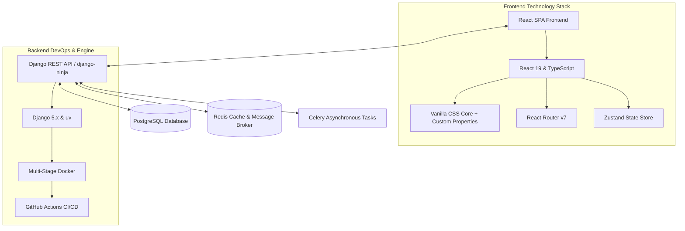

# Document 00: Hotel Ordering Platform - Documentation Blueprint & Technical Architecture

This document serves as the master blueprint for the Hotel Ordering Platform. It establishes the system architecture, directory structures, global technology standards, and maps out the 21-part comprehensive specification for the entire platform.

---

## 1. Project Overview & Architectural Vision
The Hotel Ordering Platform is a modern, high-performance web application designed to connect users (diners/buyers) with local hotels and food distributors. The system is split into two core views: a customer-facing portal for discovering hotels, viewing menus, scheduling orders, and selecting delivery options; and a distributor-facing portal for managing hotel profiles, food items, delivery options, and order fulfillment queues.

### High-Level Architecture Diagram


---

## 2. Directory Structure Conventions

To ensure clean code separation, the project follows standard repository organization guidelines:

```
hotel-web-platform/
├── backend/                  # Django project root (managed with uv)
│   ├── pyproject.toml        # Dependencies and project metadata
│   ├── uv.lock               # uv lockfile for deterministic builds
│   ├── Dockerfile            # Multi-stage production-grade Docker build
│   ├── .dockerignore
│   ├── entrypoint.sh         # Application entry point script
│   ├── manage.py
│   ├── config/               # Settings, main urls, wsgi/asgi
│   │   ├── settings.py
│   │   ├── urls.py
│   │   └── api.py            # API routing entry point
│   ├── apps/                 # Django App modules
│   │   ├── authentication/   # Custom user, login/signup endpoints
│   │   ├── hotels/           # Hotel profile and location data
│   │   ├── menu/             # Food items, pricing, availability
│   │   └── orders/           # Order processing, delivery slot management
│   └── tests/                # Django integration & unit tests
│
├── frontend/                 # React SPA root
│   ├── package.json
│   ├── vite.config.ts        # Vite build tool setup
│   ├── tsconfig.json
│   ├── public/               # Static public assets
│   ├── src/
│   │   ├── main.tsx          # React application mount point
│   │   ├── App.tsx           # Global routing & layout wrapper
│   │   ├── assets/           # Global fonts, base images
│   │   ├── components/       # Shared UI components (Buttons, Inputs, Modals)
│   │   ├── features/         # Feature-specific modules
│   │   │   ├── auth/         # Auth forms, modals, hooks
│   │   │   ├── customer/     # Customer home, details, scheduling UI
│   │   │   └── distributor/  # Distributor portal panels, CRUD forms
│   │   ├── hooks/            # Global custom hooks
│   │   ├── services/         # API client & fetchers (Axios-based wrapper)
│   │   ├── store/            # State management (Zustand stores)
│   │   └── styles/           # Global CSS variables, reset, themes
│   │       ├── variables.css # Premium HSL-based colors & sizes
│   │       └── index.css     # Base styles and animations
│   └── tests/                # Vitest & Testing Library tests
│
└── docs/                     # Architectural & UI Specifications
    ├── 00_documentation_blueprint.md
    ├── 01_home_feed_page.md
    ├── 02_hotel_details_page.md
    └── ... [Files 03 to 20]
```

---

## 3. The 21-Part Document Index

Here is the complete catalog of specifications we are building. Each document is a self-contained, implementation-ready specification complete with user flows, detailed UI mockups, interaction states, API endpoints, database schemas, and configuration settings:

| Doc ID | Category | Document Name & Description | Status |
|---|---|---|---|
| **00** | **System** | **[00_documentation_blueprint.md](file:///d:/Hotel_web/docs/00_documentation_blueprint.md)** - Master technical stack, directory layout, and specifications blueprint. | **Active** |
| **01** | **Customer** | **[01_home_feed_page.md](file:///d:/Hotel_web/docs/01_home_feed_page.md)** - High-fidelity home feed showing registered hotels, search widgets, category tabs, and active orders. | *Pending* |
| **02** | **Customer** | **[02_hotel_details_page.md](file:///d:/Hotel_web/docs/02_hotel_details_page.md)** - Hotel detailed view (location map, menu filtering, instant/custom items, delivery availability state). | *Pending* |
| **03** | **Customer** | **[03_hotel_order_scheduling_page.md](file:///d:/Hotel_web/docs/03_hotel_order_scheduling_page.md)** - Advanced scheduling layout (date/time slot matrix, order-ahead requirements, kitchen lead time UI). | *Pending* |
| **04** | **Customer** | **[04_cart_checkout_page.md](file:///d:/Hotel_web/docs/04_cart_checkout_page.md)** - Split-view checkout (home delivery vs self-pickup, offline payment configuration, address coordinates pin). | *Pending* |
| **05** | **Customer** | **[05_order_success_tracking_page.md](file:///d:/Hotel_web/docs/05_order_success_tracking_page.md)** - Real-time order tracker, estimated time of arrival (ETA), and direct chat/call hooks for customer-hotel. | *Pending* |
| **06** | **Auth** | **[06_auth_registration_modal.md](file:///d:/Hotel_web/docs/06_auth_registration_modal.md)** - Dismissible modal UI, registration paths (Buyer vs Distributor), validation schema, and redirect triggers. | *Pending* |
| **07** | **Customer** | **[07_user_profile_dashboard.md](file:///d:/Hotel_web/docs/07_user_profile_dashboard.md)** - User profile dashboard, saved addresses library, communication preferences, and security settings. | *Pending* |
| **08** | **Customer** | **[08_user_order_history.md](file:///d:/Hotel_web/docs/08_user_order_history.md)** - Historical order logs, PDF invoice downloader, single-click order repetition, and feedback ratings. | *Pending* |
| **09** | **Distributor**| **[09_distributor_dashboard_overview.md](file:///d:/Hotel_web/docs/09_distributor_dashboard_overview.md)** - Management portal main page: real-time sales overview, rapid order pipeline stats, and sound-alert engine. | *Pending* |
| **10** | **Distributor**| **[10_distributor_hotel_profile.md](file:///d:/Hotel_web/docs/10_distributor_hotel_profile.md)** - Hotel details configuration (Google Map anchor, banner/gallery manager, operations timeline). | *Pending* |
| **11** | **Distributor**| **[11_distributor_menu_management.md](file:///d:/Hotel_web/docs/11_distributor_menu_management.md)** - Full CRUD menu tool: custom preparation toggles, stock availability flags, category creation, and pricing. | *Pending* |
| **12** | **Distributor**| **[12_distributor_delivery_settings.md](file:///d:/Hotel_web/docs/12_distributor_delivery_settings.md)** - Advanced delivery settings: radius range map tracker, fees matrix, free delivery thresholds, self-pickup parameters. | *Pending* |
| **13** | **Distributor**| **[13_distributor_order_queue.md](file:///d:/Hotel_web/docs/13_distributor_order_queue.md)** - Operational queue: accepting, preparing, dispatched, and completed states. Print receipt integration. | *Pending* |
| **14** | **Distributor**| **[14_distributor_sales_reports.md](file:///d:/Hotel_web/docs/14_distributor_sales_reports.md)** - Analytical hub: sales charting (revenue vs volume), peak sales days, most popular items, and CSV/PDF export. | *Pending* |
| **15** | **Distributor**| **[15_distributor_staff_management.md](file:///d:/Hotel_web/docs/15_distributor_staff_management.md)** - Multi-account sub-users configuration: cashier, cook, delivery agent access levels. | *Pending* |
| **16** | **System** | **[16_notification_center_ui.md](file:///d:/Hotel_web/docs/16_notification_center_ui.md)** - Notification pane: push service registration, sound-alert settings, message templates, status indicators. | *Pending* |
| **17** | **System** | **[17_help_support_center.md](file:///d:/Hotel_web/docs/17_help_support_center.md)** - Ticket creation system, customer-distributor direct dispute logging, dynamic FAQ search. | *Pending* |
| **18** | **System** | **[18_admin_super_console.md](file:///d:/Hotel_web/docs/18_admin_super_console.md)** - Admin console for hotel approval, user flags, system-wide transaction reports, global configuration toggles. | *Pending* |
| **19** | **System** | **[19_ui_ux_design_system.md](file:///d:/Hotel_web/docs/19_ui_ux_design_system.md)** - Design system standards: colors (primary, accent, background), components, fonts, layout, and motion design. | *Pending* |
| **20** | **System** | **[20_backend_architecture.md](file:///d:/Hotel_web/docs/20_backend_architecture.md)** - Django application models, APIs, Redis queue configurations, Docker Compose structure, and CI/CD scripts. | *Pending* |

---

## 4. Global Technical Standards

### A. Frontend Architecture (React)
- **State Management**: Zustand is selected over Redux to avoid complex boilerplates. State stores are divided logically (e.g., `useAuthStore`, `useCartStore`).
- **Styling**: Vanilla CSS utilizing custom variables defined in `variables.css`. CSS Nesting (native modern browser support) is used to maintain scoped styles without heavy dependencies.
- **Component Standard**: Functional Components utilizing TypeScript, strict typing for props, and lazy loading for routes using `React.lazy` and `Suspense`.

### B. Backend Architecture (Django)
- **Django Package Manager**: `uv` replaces legacy pip/virtualenv systems, offering lightning-fast dependency resolution and lockfile consistency.
- **API Engine**: Using `django-ninja` for Type-hinted, high-performance REST APIs (auto-generating OpenAPI docs via Swagger UI).
- **Environment Management**: Dockerized environments separate local development and production. Celery processes background workflows (such as scheduler alerts) via a Redis queue.

---

## 5. Next Steps
We are starting with **Document 01: Home Feed Page Specification**. 
When you are ready, request the next document, and we will construct the high-fidelity UI layout, interactive components, user flows, and technical mappings for it.
