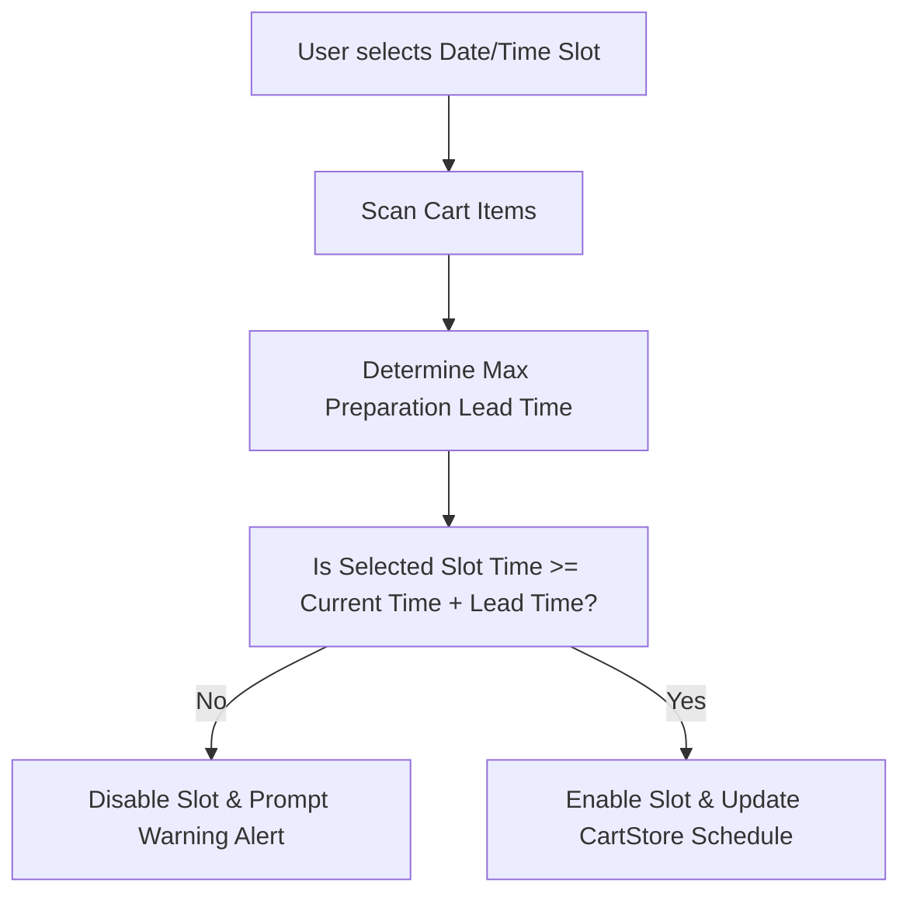

# Document 03: Hotel Ordering Platform - Order Scheduling Page UI & Functionality

This document details the user interface, date-time selection matrices, lead-time checks, custom order scheduling controls, state management, and backend endpoints for the scheduling flow.

---

## 1. Page Layout & Wireframe
The Order Scheduling page allows buyers to define exactly when they want their order prepared and delivered (or picked up). It uses a dynamic calendar selector, a time-slot selection grid, and automated lead-time validations.

```
+-------------------------------------------------------------------------+
| [Header - Reused from Doc 01]                                           |
+-------------------------------------------------------------------------+
|                                                                         |
|  <- Back to Hotel Menu                                                  |
|                                                                         |
|  Schedule Your Order                                                    |
|                                                                         |
|  1. Select Delivery/Pickup Date:                                        |
|  +-------------------------------------------------------------------+  |
|  | [ < ]  May 2026                                              [ > ]|  |
|  | Sun   Mon   Tue   Wed   Thu   Fri   Sat                           |  | -> Calendar Selector
|  | 24    25    26    27    28    [29]  30                            |  |    (Today Selected)
|  | 31    1     2     3     4     5     6                             |  |
|  +-------------------------------------------------------------------+  |
|                                                                         |
|  2. Select Time Slot:                                                   |
|  +-------------------------------------------------------------------+  |
|  | [09:00 - 09:30]  [09:30 - 10:00]  [10:00 - 10:30]  [10:30 - 11:00] |  |
|  | [11:00 - 11:30]  [11:30 - 12:00]  [12:00 - 12:30]  [12:30 - 13:00] |  | -> Time Slot Grid
|  | [13:00 - 13:30]* [13:30 - 14:00]  [14:00 - 14:30]  [14:30 - 15:00] |  |
|  +-------------------------------------------------------------------+  |
|  * Earliest available slot is 01:00 PM due to custom pre-order items.   | -> Lead-time Notice
|                                                                         |
|  +-------------------------------------------------------------------+  |
|  | [Special Delivery Instructions / Allergy Notes:                 ] |  | -> Instructions
|  +-------------------------------------------------------------------+  |
|                                                                         |
|  [ Proceed to Checkout: $21.50 ]                                        | -> Primary Action
|                                                                         |
+-------------------------------------------------------------------------+
| [Footer - Reused from Doc 01]                                           |
+-------------------------------------------------------------------------+
```

---

## 2. Interactive Component Specifications

### A. Calendar Selector Component (`<CalendarSelector />`)
- **Interaction**:
  - Displays the current month with active days.
  - Prevents selection of past dates.
  - Limits scheduling to 14 days in the future to keep kitchen operations predictable.
  - Clicking a date triggers an API fetch to load available time slots for that specific day.

### B. Time Slot Grid Component (`<TimeSlotGrid />`)
- **Rules**:
  - Time slots are generated in 30-minute intervals aligned with the hotel's operating hours.
  - **Lead-Time Calculation Logic**:
    - The client checks all items in `useCartStore`. It finds the item with the maximum `preparation_time_hours`.
    - If `max_prep_time` = 2.0 hours, and the current time is 11:00 AM, all slots prior to 01:00 PM are marked disabled (non-clickable).
  - Slots outside the hotel's open/close times are omitted entirely.
  - Selected slot is styled with a prominent solid color border and checkmark icon.

### C. Lead-Time Alert Box
- **Behavior**: If any time slots are disabled because of custom items, display a helpful notification:
  - Text: `"💡 Earliest available slot is [Calculated Time] because your cart contains items requiring advance preparation."`
  - Style: Soft blue accent container with micro-pulse icon.

### D. Special Instructions Text Area
- **Behavior**: An optional text box for food customizations, delivery instructions, or food allergies. Persisted in `useCartStore` under the field `specialInstructions`.

---

## 3. Scheduling Validation Rules



---

## 4. Frontend State & Backend API Schema

### Zustand Store: Update `useCartStore`
```typescript
interface CartStore {
  // Existing state...
  scheduledDate: string | null;          // Format: YYYY-MM-DD
  scheduledTimeSlot: string | null;      // Format: HH:MM-HH:MM
  specialInstructions: string;
  setSchedule: (date: string, timeSlot: string) => void;
  setSpecialInstructions: (text: string) => void;
}
```

### Backend API Integration
- **Endpoint**: `/api/hotels/:id/delivery-slots/`
- **Method**: `GET`
- **Query Parameters**:
  - `date`: string (YYYY-MM-DD)
- **Response Format**:
  ```json
  {
    "date": "2026-05-29",
    "operating_hours": {
      "open": "08:00:00",
      "close": "22:00:00"
    },
    "booked_slots_capacity": [
      {
        "slot": "12:00-12:30",
        "is_full": false
      },
      {
        "slot": "12:30-13:00",
        "is_full": true
      }
    ]
  }
  ```

---

## 5. Next Steps
We will proceed to **Document 04: Cart & Checkout Page UI & Functionality**, which handles split-view checkout options, home delivery details, and offline payment. Say "Next" to continue.
