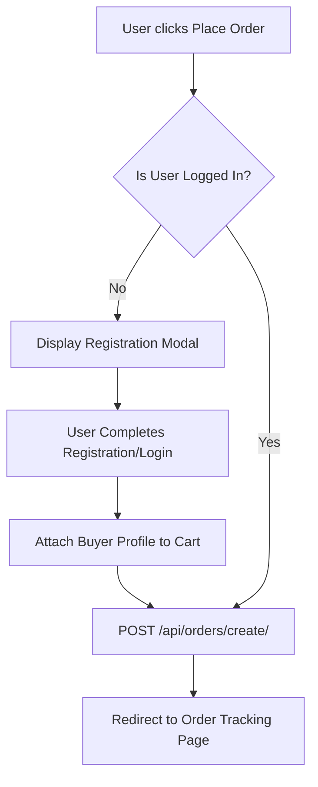

# Document 04: Hotel Ordering Platform - Cart & Checkout Page UI & Functionality

This document details the user interface, split-view columns, checkout validation rules (including delivery mode verification, logged-in status checks, and offline-only payment), state management, and backend endpoints for the Checkout process.

---

## 1. Page Layout & Wireframe
The Cart & Checkout page is designed as a responsive two-column grid. The left column contains the delivery mode selector, address details, and payment config; the right column holds the itemized summary and order trigger button.

```
+-------------------------------------------------------------------------+
| [Header - Reused from Doc 01]                                           |
+-------------------------------------------------------------------------+
|                                                                         |
|  Checkout                                                               |
|                                                                         |
|  +-----------------------------------+   +----------------------------+ |
|  | 1. Delivery Option                |   | 2. Order Summary           | |
|  | [ Home Delivery ]  [ Self-Pickup ]|   | Spicy Paneer Tikka  x2 $25 | | -> Column 2: Items Summary
|  | (Home Delivery is disabled by this|   | Coca Cola           x1 $ 2 | |
|  |  hotel. Self-Pickup only.)        |   |                            | |
|  |                                   |   | Scheduled Date: 2026-05-29 | |
|  | Delivery Address:                 |   | Time Slot: 13:00 - 13:30   | |
|  | [ 123 Main Street, Apt 4B       ] |   | -------------------------- | |
|  | [Select Address from Profile]     |   | Subtotal:           $27.00 | |
|  | [Pin Location on Google Maps]     |   | Delivery Fee:        $0.00 | |
|  |                                   |   | Total (incl Tax):   $29.50 | |
|  | 3. Payment Method                 |   +----------------------------+ |
|  | (o) Cash on Delivery / Pay Hotel  |                                  |
|  | (x) Credit Card / UPI (Online UI  |   +----------------------------+ |
|  |     coming soon in next phase)    |   | [ Place Order (Offline) ]  | | -> Action Trigger
|  +-----------------------------------+   +----------------------------+ |
|                                                                         |
+-------------------------------------------------------------------------+
| [Footer - Reused from Doc 01]                                           |
+-------------------------------------------------------------------------+
```

---

## 2. Interactive Component Specifications

### A. Delivery Mode Selector (`<DeliveryModeToggle />`)
- **Interaction**:
  - Segmented control button group: `"Home Delivery"` vs `"Self-Pickup"`.
  - **Availability Validation**:
    - The client reads the `has_delivery` state of the active hotel.
    - If `has_delivery` is `false`, the `"Home Delivery"` toggle is rendered in a disabled state. Hovering over it displays a tooltip: `"This hotel does not offer home delivery. Please choose self-pickup."`
    - The toggle automatically defaults to `"Self-Pickup"`.

### B. Delivery Details & Map Location Widget
- **Fields**:
  - `Delivery Address`: Multi-line text field (disabled if Self-Pickup is selected).
  - `Google Maps Pin Button`: Opens a map widget. Allows the user to verify their location coordinates, which returns lat/lng coordinates to the order state.
- **Profile Addresses**:
  - If the user is logged in, a dropdown list of saved addresses (e.g., "Home", "Work") is populated. Selecting one pre-fills the address box and coordinates.

### C. Offline-Only Payment Panel
- **Restrictions**:
  - Radio button group for Payment Option.
  - `"Cash on Delivery / Pay at Hotel (Offline)"`: Active and selected by default.
  - `"UPI / Credit Card / Online Payment"`: Rendered in a disabled state with a greyed-out visual layout.
  - A persistent notification box is displayed:
    - Text: `"🔒 Offline Payment only. We currently support Cash on Delivery or Payment at the Hotel counter. Online payment options will be added in a future phase."`

### D. Authentication Gate & Action Button
- **Placement**: Bottom of the Order Summary column.
- **State Check**:
  - If `useAuthStore` indicates the user is **Anonymous** (not logged in):
    - Replace the "Place Order" button with: `[ Register / Log In to Place Order ]`
    - Clicking this triggers the slide-in registration modal (`06_auth_registration_modal.md`). The user details (e.g., name, phone number, delivery address) are captured and saved to the profile.
  - If the user is **Authenticated**:
    - Render the primary CTA: `[ Place Order (Offline Payment) ]`.
    - Clicking this submits the payload to the backend, clears `useCartStore`, and redirects to `05_order_success_tracking_page.md`.

---

## 3. Order Placement Flow



---

## 4. Frontend State & Backend API Schema

### Zustand Store State Check
Before submitting, verify that the order payload is populated correctly:
```typescript
interface OrderPayload {
  hotel_id: number;
  items: { food_item_id: number; quantity: number }[];
  delivery_date: string;       // YYYY-MM-DD
  delivery_time_slot: string;  // HH:MM-HH:MM
  delivery_type: 'delivery' | 'pickup';
  address: string;
  latitude: number | null;
  longitude: number | null;
  payment_method: 'offline';
}
```

### Backend API Integration
- **Endpoint**: `/api/orders/create/`
- **Method**: `POST`
- **Headers**: `Authorization: Bearer <token>`
- **Response Format (JSON)**:
  ```json
  {
    "success": true,
    "order_id": 1043,
    "status": "pending",
    "delivery_type": "pickup",
    "scheduled_time": "2026-05-29 13:00:00",
    "total_amount": 29.50
  }
  ```

---

## 5. Next Steps
We will proceed to **Document 05: Order Success & Tracking Page UI & Functionality**. This covers real-time order tracking stages, countdown widgets, hotel and delivery contact triggers, and offline payment receipts. Say "Next" to continue.
