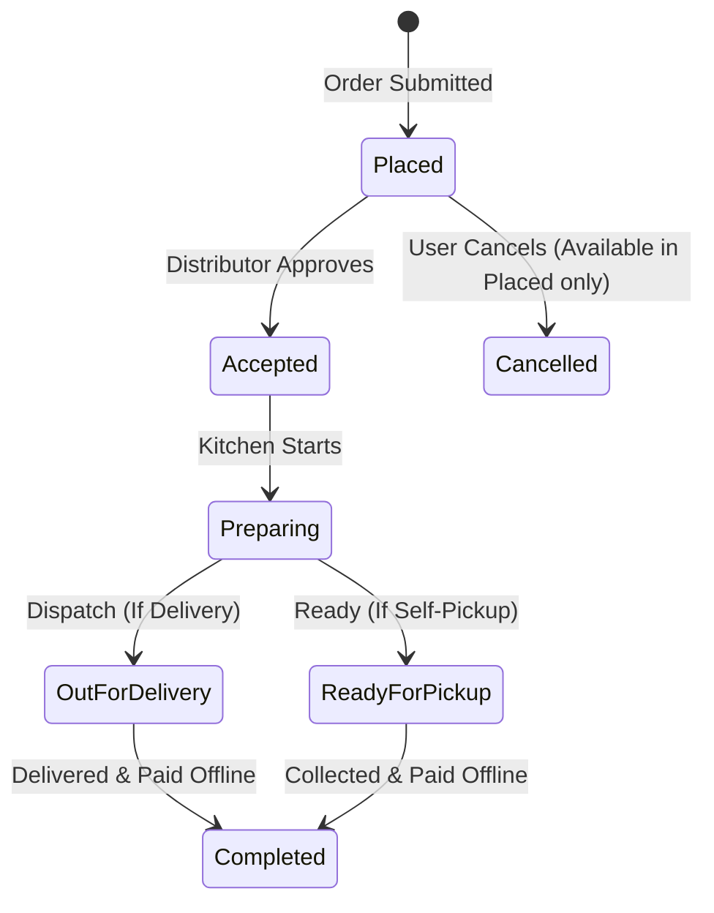

# Document 05: Hotel Ordering Platform - Order Success & Tracking Page UI & Functionality

This document details the user interface, real-time status tracker stepper, delivery route connections, action controls, and backend status synchronization for the Order Success & Tracking view.

---

## 1. Page Layout & Wireframe
The Order Success & Tracking page displays immediate confirmation of the order, visualizes preparation steps, outlines the offline payment checklist, and provides contact channels.

```
+-------------------------------------------------------------------------+
| [Header - Reused from Doc 01]                                           |
+-------------------------------------------------------------------------+
|                                                                         |
|  ✔ Order Placed Successfully!                                           |
|  Order ID: #1043  |  Estimated Preparation/Delivery: 1:30 PM            | -> Hero Block
|  Payment: Cash on Delivery / Pay at Hotel ($29.50)                     |
|                                                                         |
|  Track Your Order Status:                                               |
|  +-------------------------------------------------------------------+  |
|  |  (●) ----------> (●) ----------> (◯) ----------> (◯) ----------> (◯) |  |
|  | Placed        Accepted       Preparing      Out for Deliv   Complete |  | -> Visual Stepper
|  | 12:45 PM      12:48 PM       (Active)                                |  |
|  +-------------------------------------------------------------------+  |
|                                                                         |
|  Delivery Information:                                                  |
|  +-----------------------------------+   +----------------------------+ |
|  | Distributor Details               |   | Route & Map                | |
|  | Grand Palace Hotel                |   | Delivery: 123 Main Street  | | -> Split Details
|  | Contact: +1234567890              |   |                            | |
|  | [ Call Distributor ]              |   | [ View Directions on Map ] | |
|  +-----------------------------------+   +----------------------------+ |
|                                                                         |
|  [ Cancel Order (Available only during 'Placed' stage) ]                 | -> Danger CTA
|                                                                         |
+-------------------------------------------------------------------------+
| [Footer - Reused from Doc 01]                                           |
+-------------------------------------------------------------------------+
```

---

## 2. Interactive Component Specifications

### A. Success & Payment Summary Card
- **Visuals**: Vibrant green banner with a drop-shadow container.
- **Offline Receipt Details**:
  - Highlights: Final balance to be collected, delivery date and time slot.
  - Text: `"Please have exact change ready for Cash on Delivery"` or `"Please pay at the front counter when picking up your order"`, dynamically set based on the checkout selection.

### B. Real-Time Status Stepper (`<StatusStepper />`)
- **Interaction**:
  - Visual timeline linking 5 operational states:
    1. **Placed**: Order received by backend.
    2. **Accepted**: Distributor acknowledged and scheduled preparation.
    3. **Preparing**: Food in active production in the kitchen.
    4. **Out for Delivery** (for Home Delivery) OR **Ready for Pickup** (for Self-Pickup).
    5. **Completed**: Order marked delivered/collected.
  - Active steps are filled with high-contrast color; completed steps show a checkmark; pending steps are semi-transparent.
  - An pulsing indicator ring glows around the active state.

### C. Direct Distributor Contact Hooks
- **Call Button**:
  - An interactive button containing a phone icon that triggers a mobile dialer link (`tel:${hotel_phone}`).
- **Route Coordinates Widget**:
  - If Home Delivery is active:
    - Button opens Google Maps showing a navigation route from the Hotel coordinates to the User's pinned coordinates.
  - If Self-Pickup is active:
    - Button opens Google Maps directions leading the user straight to the Hotel's location coordinates.

### D. Order Cancellation Option
- **Behavior**:
  - The `"Cancel Order"` button is only clickable if the order is in the `Placed` status (before the distributor clicks "Accept").
  - Once the status changes to `Accepted` or beyond, the cancel button is hidden/disabled, showing: `"This order is being prepared and can no longer be cancelled. Contact the hotel for adjustments."`

---

## 3. Order Status State Machine



---

## 4. Frontend State & Backend API Schema

### Zustand Store: `useActiveOrderStore`
Manages polling intervals and stores status info:
```typescript
interface ActiveOrderState {
  orderId: number | null;
  status: 'placed' | 'accepted' | 'preparing' | 'out_for_delivery' | 'ready_for_pickup' | 'completed' | 'cancelled';
  eta: string;
  hotelPhone: string;
  hotelAddress: string;
  userAddress: string;
  deliveryType: 'delivery' | 'pickup';
  totalAmount: number;
  startPolling: (orderId: number) => void;
  stopPolling: () => void;
}
```

### Backend API Integration
- **Status Sync Polling**:
  - Client makes a GET request every 10 seconds to sync status.
  - **Endpoint**: `/api/orders/:id/status/`
  - **Method**: `GET`
  - **Response Format (JSON)**:
    ```json
    {
      "order_id": 1043,
      "status": "preparing",
      "eta": "2026-05-29T13:30:00Z",
      "delivery_type": "delivery",
      "hotel_phone": "+1234567890",
      "hotel_coordinates": { "lat": 40.7128, "lng": -74.0060 },
      "user_coordinates": { "lat": 40.7200, "lng": -74.0100 },
      "total_amount": 29.50
    }
    ```

---

## 5. Next Steps
We will proceed to **Document 06: Authentication & Registration Modal UI & Functionality**. This covers the modal popup, sign-up forms for buyers and distributors, inputs validation, and redirection logic. Say "Next" to continue.
