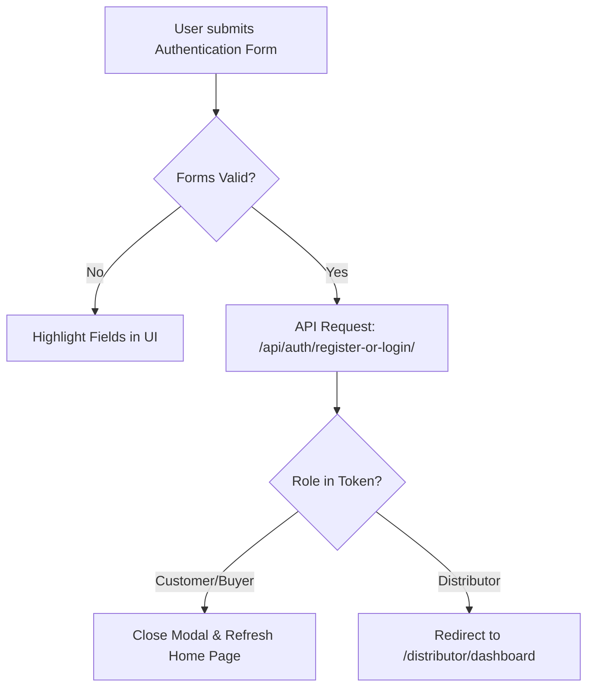

# Document 06: Hotel Ordering Platform - Authentication & Registration Modal UI & Functionality

This document details the user interface, dismissibility logic, input forms, role classification (Customer vs. Distributor), validation schemas, and redirection workflows for the Authentication Modal.

---

## 1. Page Layout & Wireframe
The Authentication Modal is rendered as an overlay on top of the active page. It features slide-in transitions, a dismissible backdrop, and role-selection panels.

```
+-------------------------------------------------------------------------+
| [Background Page - Blurred & Dimmed]                                    |
|  +-------------------------------------------------------------------+  |
|  | [Modal Card]                                           [ Close X ]|  | -> Close Trigger
|  |                                                                   |  |
|  |                 Welcome to Hotel Express                          |  |
|  |                                                                   |  |
|  |         [ Sign In Tab ]     |     [ Sign Up Tab (Active) ]        |  | -> Form Tabs
|  |  ---------------------------------------------------------------  |  |
|  |                                                                   |  |
|  |  Join as:                                                         |  |
|  |  [ (o) Customer / Buyer ]      [ ( ) Hotel Owner / Distributor ]  |  | -> Role Selection
|  |                                                                   |  |
|  |  Full Name:      [ Enter your name                     ]          |  |
|  |  Email Address:  [ Enter your email address            ]          |  |
|  |  Phone Number:   [ Enter your phone number             ]          |  | -> Input Fields
|  |  Password:       [ Enter security password             ]          |  |
|  |                                                                   |  |
|  |  [ Create Account ]                                               |  | -> Primary CTA
|  |                                                                   |  |
|  +-------------------------------------------------------------------+  |
+-------------------------------------------------------------------------+
```

---

## 2. Interactive Component Specifications

### A. Dismissible Backdrop & Card Container
- **Backdrop Styling**:
  - Darkened background overlay (`background: rgba(0, 0, 0, 0.6)`) paired with a modern blur (`backdrop-filter: blur(8px)`).
- **Dismissibility Triggers**:
  - Clicking the `"Close (X)"` button in the top-right corner.
  - Clicking directly on the blurred backdrop overlay (outside the Modal Card limits).
  - Pressing the `Escape` key on physical keyboards.
- **Exception Rule**:
  - If the modal is opened by the Checkout checkout-gate block, dismissing the modal returns the user to the cart review screen with an warning alert: `"Authentication is required to place your order."`

### B. Tab & Role Selector Toggles
- **Tab State**: Toggles between `Sign In` and `Sign Up` forms, animating the container height dynamically based on the input count.
- **Role Selector Toggles (Customer vs. Distributor)**:
  - Custom card selectors or radio buttons.
  - If **Customer** is selected: Form renders fields for delivery addresses and preferences.
  - If **Distributor** is selected: Form introduces additional fields: `Hotel/Restaurant Name`, `Contact Address`, and `Distributor Register ID`.

### C. Client-Side Input Form Validation
- Standard validation schemas (e.g., using `Zod` or custom Javascript checks):
  - **Email**: Must fit regex email format (`^[^\s@]+@[^\s@]+\.[^\s@]+$`).
  - **Phone Number**: Must contain between 10 to 15 digits (numbers only).
  - **Password**: Minimum length of 8 characters, containing at least 1 uppercase letter and 1 digit.
- Error alerts display in a clean red alert typography below the respective fields in real time as the user types (on-blur verification).

---

## 3. Redirection & Role Workflow Logic



---

## 4. Frontend State & Backend API Schema

### Zustand Store: `useAuthStore`
Tracks active session, access tokens, and user profile data:
```typescript
interface UserProfile {
  id: number;
  email: string;
  name: string;
  role: 'customer' | 'distributor';
}

interface AuthStore {
  accessToken: string | null;
  user: UserProfile | null;
  isAuthenticated: boolean;
  login: (credentials: object) => Promise<void>;
  register: (payload: object) => Promise<void>;
  logout: () => void;
}
```

### Backend API Integration
- **Endpoint 1: Login**
  - Path: `/api/auth/login/`
  - Method: `POST`
  - Response:
    ```json
    {
      "access": "eyJhbGciOiJIUzI1NiIsIn...",
      "refresh": "eyJhbGciOiJIUzI1NiIsIn...",
      "user": {
        "id": 42,
        "email": "customer@email.com",
        "name": "Jane Doe",
        "role": "customer"
      }
    }
    ```

- **Endpoint 2: Registration**
  - Path: `/api/auth/register/`
  - Method: `POST`
  - Request Parameters:
    - `name`, `email`, `phone`, `password`, `role` (`customer` or `distributor`), `hotel_name` (optional, for distributors).
  - Response:
    ```json
    {
      "success": true,
      "message": "User account created successfully.",
      "user_role": "distributor"
    }
    ```

---

## 5. Next Steps
We will proceed to **Document 07: User Profile Dashboard UI & Functionality**, which covers user account editing, address managers, and order summaries. Say "Next" to continue.
