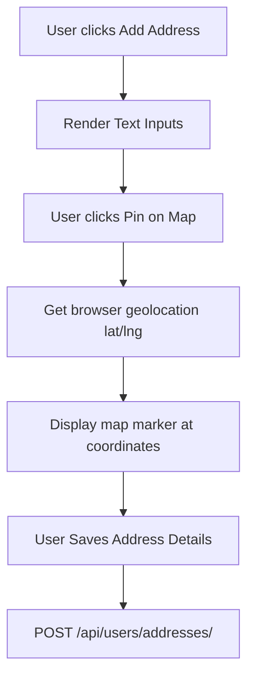

# Document 07: Hotel Ordering Platform - User Profile Dashboard UI & Functionality

This document details the user interface, sidebar navigation, profile settings form, CRUD address manager, and backend API endpoints for the Customer Profile Dashboard.

---

## 1. Page Layout & Wireframe
The User Profile Dashboard utilizes a grid layout with a side navigation panel and a main content frame that dynamically updates based on the active tab.

```
+-------------------------------------------------------------------------+
| [Header - Reused from Doc 01]                                           |
+-------------------------------------------------------------------------+
|                                                                         |
|  User Profile Dashboard                                                 |
|                                                                         |
|  +--------------------+   +------------------------------------------+  |
|  | [Sidebar Nav]      |   | Saved Addresses Manager                  |  | -> Main Content Area
|  | - Personal Info    |   |                                          |  |
|  | - Address Book (x) |   | +-----------------+  +-----------------+ |  |
|  | - Security         |   | | Home [Default]  |  | Work            | |  | -> Address Cards
|  |                    |   | | 123 Main Street |  | 456 Office Rd   | |  |
|  | [ Log Out ]        |   | | Lat: 40.71  Lng |  | Lat: 40.73  Lng | |  |
|  +--------------------+   | | [Edit] [Delete] |  | [Edit] [Delete] | |  |
|                           | +-----------------+  +-----------------+ |  |
|                           |                                          |  |
|                           | [ + Add New Address ]                    |  | -> New Address Trigger
|                           +------------------------------------------+  |
|                                                                         |
+-------------------------------------------------------------------------+
| [Footer - Reused from Doc 01]                                           |
+-------------------------------------------------------------------------+
```

---

## 2. Interactive Component Specifications

### A. Sidebar Navigation Panel
- **Items**:
  - `Personal Info`: Triggers edit form for name, email, and phone contact.
  - `Address Book`: Displays user's delivery addresses grid.
  - `Security`: Holds credentials and password updates.
- **Session Control**: A secondary `"Log Out"` button at the bottom of the sidebar clears authentication state and redirects to the landing page.

### B. Address Book Card Manager
- **Addresses Grid**: Renders a card layout for all registered user locations.
- **Card Badges**: Custom labels like `"Home"`, `"Work"`, `"Other"`, with a visual marker indicator indicating the default checkout address.
- **Interactive Actions**:
  - **Edit Address**: Opens inline modal form with current details loaded.
  - **Delete Address**: Displays a dismissible confirmation prompt: `"Are you sure you want to delete this address? This action cannot be undone."`
  - **Add New Address Widget**:
    - Displays address line text inputs.
    - Embedded coordinate button: `"Pin Location on Map"`. Clicking it lets users pinpoint their location coordinates which are stored in database latitude and longitude fields.

### C. Security Settings Card
- **Form Controls**:
  - Old Password, New Password, Confirm New Password inputs.
  - Validates that `New Password` is distinct from `Old Password` and matches `Confirm Password` exactly before unlocking the submit action.

---

## 3. Address Coordinates Pinning Flow



---

## 4. Frontend State & Backend API Schema

### Zustand Store: `useProfileStore`
Synchronizes state changes with user data updates:
```typescript
interface Address {
  id: number;
  label: string; // "Home", "Work", etc.
  address_line: string;
  latitude: number;
  longitude: number;
  is_default: boolean;
}

interface ProfileStore {
  addresses: Address[];
  fetchAddresses: () => Promise<void>;
  addAddress: (address: Omit<Address, 'id'>) => Promise<void>;
  deleteAddress: (id: number) => Promise<void>;
  updateProfileDetails: (name: string, phone: string) => Promise<void>;
}
```

### Backend API Integration
- **Endpoint 1: Update Details**
  - Path: `/api/users/profile/update/`
  - Method: `PUT`
  - Headers: `Authorization: Bearer <token>`
  - Response:
    ```json
    {
      "success": true,
      "user": {
        "email": "customer@email.com",
        "name": "Jane Doe",
        "phone_number": "+1234567890"
      }
    }
    ```

- **Endpoint 2: Fetch Addresses**
  - Path: `/api/users/addresses/`
  - Method: `GET`
  - Response:
    ```json
    [
      {
        "id": 8,
        "label": "Home",
        "address_line": "123 Main Street, Apt 4B",
        "latitude": 40.7128,
        "longitude": -74.0060,
        "is_default": true
      }
    ]
    ```

---

## 5. Next Steps
We will proceed to **Document 08: User Order History UI & Functionality**. This handles history cards, invoice downloads, re-order buttons, and feedback. Say "Next" to continue.
