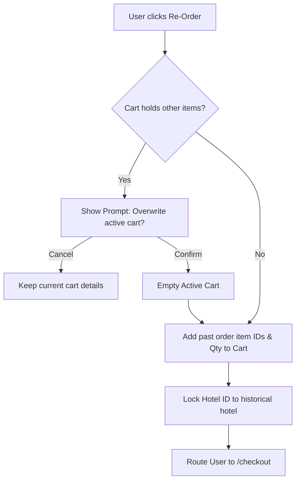

# Document 08: Hotel Ordering Platform - User Order History UI & Functionality

This document details the user interface, order logs filters, repeat-ordering (re-order) engines, review/feedback modal widgets, invoice generation interfaces, and backend API schemas for the Customer Order History view.

---

## 1. Page Layout & Wireframe
The User Order History page displays a list of past and pending orders. Users can search through order items, filter by order status, trigger rapid re-ordering, review meals, and export invoices.

```
+-------------------------------------------------------------------------+
| [Header - Reused from Doc 01]                                           |
+-------------------------------------------------------------------------+
|                                                                         |
|  Your Order History                                                     |
|  Search past orders: [ Search by hotel or meal... ]                     | -> Search Input
|  [ Filter: All | Active | Completed | Cancelled ]                        | -> Filter Pills
|                                                                         |
|  +-------------------------------------------------------------------+  |
|  | Order #1043  -  Grand Palace Hotel                                |  |
|  | Date: May 29, 2026 12:45 PM           Status: [ Preparing (Active)|  |
|  | Items: Spicy Paneer Tikka (x2), Classic Club Sandwich (x1)         |  | -> Active Order Card
|  | Total: $29.50 (Offline COD)                                       |  |
|  |                                                                   |  |
|  | [ Track Order ]   [ Download Invoice ]                            |  |
|  +-------------------------------------------------------------------+  |
|                                                                         |
|  +-------------------------------------------------------------------+  |
|  | Order #0988  -  Ocean Breeze Inn                                  |  |
|  | Date: May 12, 2026 07:15 PM           Status: [ Completed ]       |  |
|  | Items: Garlic Butter Prawns (x1), Mojito (x2)                      |  | -> Completed Card
|  | Total: $34.00 (Paid Offline)                                      |  |
|  |                                                                   |  |
|  | [ Re-Order ]      [ Write Review ]      [ Download Invoice ]      |  |
|  +-------------------------------------------------------------------+  |
|                                                                         |
+-------------------------------------------------------------------------+
| [Footer - Reused from Doc 01]                                           |
+-------------------------------------------------------------------------+
```

---

## 2. Interactive Component Specifications

### A. Order Log Filter Tabs
- **Interaction**:
  - Filter pills update the history grid instantly on the client side if the full array is loaded, or query the backend with parameters: `?status=completed`.
  - Categories:
    - `All`: Full collection.
    - `Active`: Matches `placed`, `accepted`, `preparing`, `out_for_delivery`, `ready_for_pickup`.
    - `Completed`: Historical finalized orders.
    - `Cancelled`: Aborted or rejected logs.

### B. Action Controls per Order Card
- **Track Order Button**:
  - Rendered only for active orders. Directs to `/orders/track/:id`.
- **Download Invoice Button**:
  - Initiates direct browser downloads of PDF files generated by the Django backend. Shows a loading spinner on the button text while processing.
- **Re-Order Button**:
  - **Behavior**: Clicking this performs a client-side check. It clears any items in `useCartStore`, reads the historical order's item IDs and quantities, writes them into the active cart, sets the new order's `hotelId` anchor, and routes the user directly to the `/checkout` page for quick completion.

### C. Write Review & Rating Dialog (`<ReviewModal />`)
- **Interaction**:
  - Dismissible modal containing a star input widget (1 to 5 stars selection with hover styling).
  - Text area for food quality and delivery reviews.
  - Submitting sends details to the backend database, updates the UI, and hides the "Write Review" button for that card to prevent multiple ratings.

---

## 3. Re-Order Operational Workflow



---

## 4. Frontend State & Backend API Schema

### Zustand Store: `useOrderHistoryStore`
Tracks history lists, invoices loading states, and pagination:
```typescript
interface OrderHistoryItem {
  id: number;
  hotel_name: string;
  order_date: string;
  status: string;
  items_summary: string;
  total_amount: number;
  payment_method: string;
  can_cancel: boolean;
}

interface OrderHistoryStore {
  history: OrderHistoryItem[];
  currentPage: number;
  totalPages: number;
  isLoading: boolean;
  fetchHistory: (page: number, statusFilter?: string) => Promise<void>;
  submitReview: (orderId: number, rating: number, comment: string) => Promise<void>;
}
```

### Backend API Integration
- **Endpoint 1: Fetch History**
  - Path: `/api/users/orders/`
  - Method: `GET`
  - Headers: `Authorization: Bearer <token>`
  - Request Parameters: `page` (int), `status` (string)
  - Response:
    ```json
    {
      "results": [
        {
          "id": 988,
          "hotel_name": "Ocean Breeze Inn",
          "order_date": "2026-05-12T19:15:00Z",
          "status": "completed",
          "items_summary": "Garlic Butter Prawns (x1), Mojito (x2)",
          "total_amount": 34.00,
          "payment_method": "offline"
        }
      ],
      "current_page": 1,
      "total_pages": 5
    }
    ```

- **Endpoint 2: Post Review**
  - Path: `/api/orders/:id/review/`
  - Method: `POST`
  - Request Body:
    ```json
    {
      "rating": 5,
      "comment": "Excellent food, prepared right on schedule!"
    }
    ```
  - Response: `{ "success": true, "message": "Review recorded." }`

- **Endpoint 3: PDF Invoice**
  - Path: `/api/orders/:id/invoice/`
  - Method: `GET`
  - Content-Type: `application/pdf`
  - File Content: Dynamically generated PDF transaction voucher.

---

## 5. Next Steps
We will proceed to **Document 09: Distributor Dashboard Overview UI & Functionality**. This begins the distributor portal section, detailing management panels, daily sales queues, revenue metrics charts, and live sound alerts. Say "Next" to continue.
