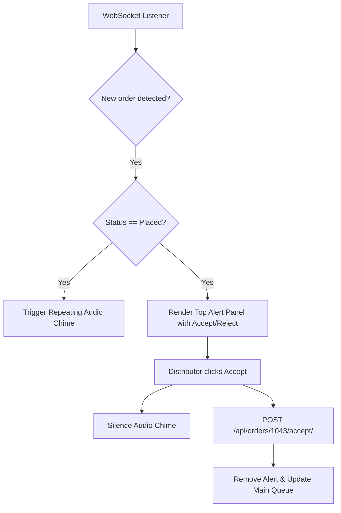

# Document 09: Hotel Ordering Platform - Distributor Portal Overview UI & Functionality

This document details the user interface, sidebar portal navigation, dashboard KPI metric cards, active mini order trackers, sales chart elements, live sound alert engines, and backend analytics APIs for the Hotel Distributor Dashboard.

---

## 1. Page Layout & Wireframe
The Distributor Dashboard Overview uses a multi-column management grid. It features a sticky sidebar navigation menu, top KPI dashboard cards, a mini-queue of incoming orders with rapid controls, and an operations chart section.

```
+-------------------------------------------------------------------------+
| [Header: Distributor Name | Hotel Status (Online/Offline Toggle)       ]|
+-------------------------------------------------------------------------+
|                                                                         |
|  Distributor Workspace - Dashboard Overview                             |
|                                                                         |
|  +-------------------+  +--------------------------------------------+  |
|  | [Sidebar Portal]  |  | Today's KPIs:                              |  |
|  | - Dashboard (Act) |  | [ Revenue: $420 ]    [ Active Orders: 4 ]  |  | -> KPI Metrics Bar
|  | - Hotel Profile   |  | [ Scheduled: 12 ]    [ Deliveries: 2 ]     |  |
|  | - Menu Manager    |  +--------------------------------------------+  |
|  | - Delivery Setup  |                                                |
|  | - Orders Queue    |  +--------------------------------------------+  |
|  | - Reports         |  | Incoming Alerts (New Orders)               |  |
|  | - Staff Accounts  |  | Order #1043 - Jane Doe - $29.50 (COD)      |  | -> Mini Order Queue
|  |                   |  | [ Accept (Green) ]     [ Reject (Red) ]    |  |
|  | [ Log Out ]       |  +--------------------------------------------+  |
|  +-------------------+                                                |
|                         +--------------------------------------------+  |
|                         | Daily Performance (Last 7 Days Sales)      |  | -> Performance Chart
|                         | [Visual SVG Chart Mock Area]               |  |
|                         +--------------------------------------------+  |
|                                                                         |
+-------------------------------------------------------------------------+
| [Footer - Reused from Doc 01]                                           |
+-------------------------------------------------------------------------+
```

---

## 2. Interactive Component Specifications

### A. Hotel Status Switch (Online/Offline Toggle)
- **Visuals**: A prominent status toggle switch in the header.
- **Behavior**:
  - Toggling `"Online"` marks the hotel active in the customer home feed.
  - Toggling `"Offline"` disables ordering for the hotel and displays a notice to customers on the Hotel Details page: `"This hotel is currently closed and not accepting orders."`

### B. KPI Stats Dashboard Cards
- **Fields**:
  - `Today's Revenue`: Sum of completed orders paid offline (COD or counter) today.
  - `Active Orders`: Count of orders currently in `Placed`, `Accepted`, or `Preparing` states.
  - `Scheduled Orders`: Count of future orders scheduled for upcoming dates.
  - `Deliveries Active`: Count of active orders marked `Out for Delivery`.
- **Transitions**: Values trigger progress counter animations when the dashboard loads.

### C. Live Incoming Order Sound Alerts
- **Mechanism**:
  - WebSockets (or short polling) monitor incoming orders.
  - When an order in the `Placed` state is detected:
    - Render a highlighted alert card at the top of the workspace.
    - Trigger a repeating chime sound effect (configured in Document 16's sound manager) to alert staff.
    - Actioning the order (`Accept` or `Reject`) stops the sound loop.

### D. Sidebar Portal Navigation
- Provides routing across all distributor views:
  - `Dashboard`: Overview of stats.
  - `Hotel Profile`: Set banner images, address, location coordinates map pins.
  - `Menu Manager`: Add dishes, update pricing, toggle availability.
  - `Delivery Setup`: Set delivery radius, flat rates, toggle delivery mode.
  - `Orders Queue`: Operational workspace for orders in progress.
  - `Reports`: Download revenue reports.
  - `Staff Accounts`: Create sub-accounts.

---

## 3. Live Alert Sound & Push Flow



---

## 4. Frontend State & Backend API Schema

### Zustand Store: `useDistributorStore`
Holds active dashboard indicators:
```typescript
interface DashboardKPIs {
  today_revenue: number;
  active_orders_count: number;
  scheduled_orders_count: number;
  active_deliveries_count: number;
}

interface DistributorStore {
  kpis: DashboardKPIs | null;
  hotelIsOnline: boolean;
  isLoading: boolean;
  fetchKPIs: () => Promise<void>;
  toggleOnlineStatus: () => Promise<void>;
}
```

### Backend API Integration
- **Endpoint 1: KPI Statistics**
  - Path: `/api/distributor/dashboard-stats/`
  - Method: `GET`
  - Headers: `Authorization: Bearer <token>`
  - Response:
    ```json
    {
      "today_revenue": 420.00,
      "active_orders_count": 4,
      "scheduled_orders_count": 12,
      "active_deliveries_count": 2,
      "weekly_sales_trend": [
        { "day": "Mon", "sales": 150.00 },
        { "day": "Tue", "sales": 230.00 },
        { "day": "Wed", "sales": 310.00 },
        { "day": "Thu", "sales": 280.00 },
        { "day": "Fri", "sales": 420.00 }
      ]
    }
    ```

- **Endpoint 2: Online Status Toggle**
  - Path: `/api/distributor/status/toggle/`
  - Method: `POST`
  - Response:
    ```json
    {
      "success": true,
      "is_online": true
    }
    ```

---

## 5. Next Steps
We will proceed to **Document 10: Distributor Hotel Profile UI & Functionality**. This covers hotel settings, map coordinates configuration, operating hours, and banner image uploads. Say "Next" to continue.
