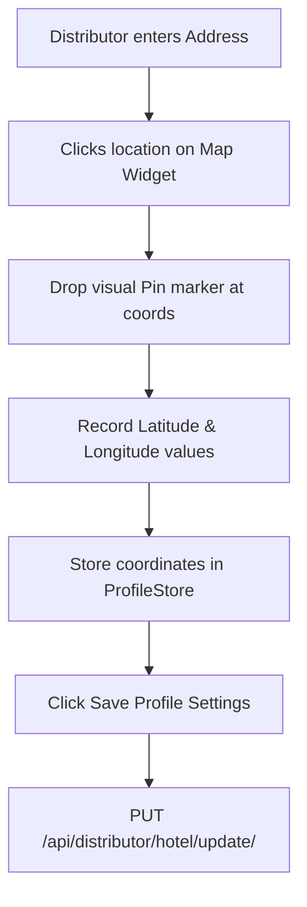

# Document 10: Hotel Ordering Platform - Distributor Hotel Profile Configuration UI & Functionality

This document details the user interface, split forms, media uploaders, Google Maps coordinate bindings, input validations, and backend endpoints for the Distributor's Hotel Profile Setup page.

---

## 1. Page Layout & Wireframe
The Hotel Profile Configuration workspace is structured as a split layout. The left column edits identity details, contact data, and operating timelines. The right column handles image uploads and coordinates anchoring.

```
+-------------------------------------------------------------------------+
| [Header - Reused from Doc 09]                                           |
+-------------------------------------------------------------------------+
|                                                                         |
|  Hotel Profile Setup & Details                                          |
|                                                                         |
|  +--------------------+   +------------------------------------------+  |
|  | [Sidebar Portal]   |   | Hotel Identity Form                      |  |
|  | - Dashboard        |   | Hotel Name:   [ Grand Palace Hotel     ] |  | -> Fields
|  | - Profile (Act)    |   | Contact Tel:  [ +1234567890            ] |  |
|  | - Menu Manager     |   | Address:      [ Central Avenue, Ste 10 ] |  |
|  | - Delivery Setup   |   | Open Time:    [ 08:00 AM ] Close: [10PM] |  |
|  | - Orders Queue     |   +------------------------------------------+  |
|  | - Reports          |   | Media Assets (Drag-and-Drop)             |  |
|  | - Staff Accounts   |   | [ + Upload Banner ] [ + Upload Gallery ] |  | -> Media Uploader
|  |                    |   +------------------------------------------+  |
|  | [ Log Out ]        |   | Google Maps Coordinate Pin               |  |
|  +--------------------+   | [ Map: Pin Selected Lat:40.71 Lng:-74.0] |  | -> Map Anchor
|                           | [ Save Profile Settings ]                |  | -> Primary Action
|                           +------------------------------------------+  |
|                                                                         |
+-------------------------------------------------------------------------+
| [Footer - Reused from Doc 01]                                           |
+-------------------------------------------------------------------------+
```

---

## 2. Interactive Component Specifications

### A. Hotel Identity Form & Operating Hours
- **Inputs**:
  - `Hotel Name` & `Physical Address`: Required text fields.
  - `Contact Telephone`: Validates string pattern.
  - `Operating Hours (Opening / Closing)`: Custom time-picker inputs.
- **Time Window Validation**:
  - The client checks that `opening_time` is chronologically prior to `closing_time`. If invalid (e.g. Open 10:00 PM, Close 08:00 AM), highlight border in red and show error message: `"Closing time must be after opening time."`

### B. Media Assets Uploader Widget
- **Drag-and-Drop Dropzone**:
  - Accepts image file formats: `.jpg`, `.jpeg`, `.png`. File size capped at 5MB.
  - Displays thumbnail previews of uploaded images inside cards containing delete icons.
  - **Upload Progress Bar**: Visual loading indicators showing API request progress percentages.

### C. Google Map Coordinates Pin Drop
- **Interactive Map Widget**:
  - Embeds interactive map container.
  - Clicking anywhere on the map drops a red location pin and records coordinates into state variables: `latitude` and `longitude`.
  - A search field is provided above the map to search address queries and center the map on the search coordinates.
  - Coordinates are sent to the backend, enabling the client-side customer portal's "View on Google Map" button to open the exact coordinates pin.

---

## 3. Location Pinning Workflows



---

## 4. Frontend State & Backend API Schema

### Zustand Store: `useDistributorProfileStore`
Manages profile configurations:
```typescript
interface HotelProfile {
  name: string;
  contact_number: string;
  address: string;
  opening_time: string;
  closing_time: string;
  latitude: number;
  longitude: number;
  banner_image: string | null;
  gallery_images: string[];
}

interface DistributorProfileStore {
  profile: HotelProfile | null;
  isLoading: boolean;
  fetchProfile: () => Promise<void>;
  updateProfile: (profileData: HotelProfile) => Promise<void>;
  uploadBanner: (file: File) => Promise<void>;
}
```

### Backend API Integration
- **Endpoint 1: Fetch Profile**
  - Path: `/api/distributor/hotel/`
  - Method: `GET`
  - Headers: `Authorization: Bearer <token>`
  - Response:
    ```json
    {
      "id": 1,
      "name": "Grand Palace Hotel",
      "contact_number": "+1234567890",
      "address": "Central Avenue, Suite 10",
      "opening_time": "08:00:00",
      "closing_time": "22:00:00",
      "latitude": 40.7128,
      "longitude": -74.0060,
      "banner_image": "https://cdn.platform.com/images/hotels/1.png",
      "gallery_images": [
        "https://cdn.platform.com/images/hotels/1_gal1.jpg",
        "https://cdn.platform.com/images/hotels/1_gal2.jpg"
      ]
    }
    ```

- **Endpoint 2: Update Profile Details**
  - Path: `/api/distributor/hotel/update/`
  - Method: `PUT`
  - Request Parameters: JSON block matching the fetch response format.
  - Response: `{ "success": true, "message": "Profile updated successfully." }`

---

## 5. Next Steps
We will proceed to **Document 11: Distributor Menu Management UI & Functionality**. This covers menu categories configuration, food item CRUD actions, price editing, and custom order lead-time values. Say "Next" to continue.
