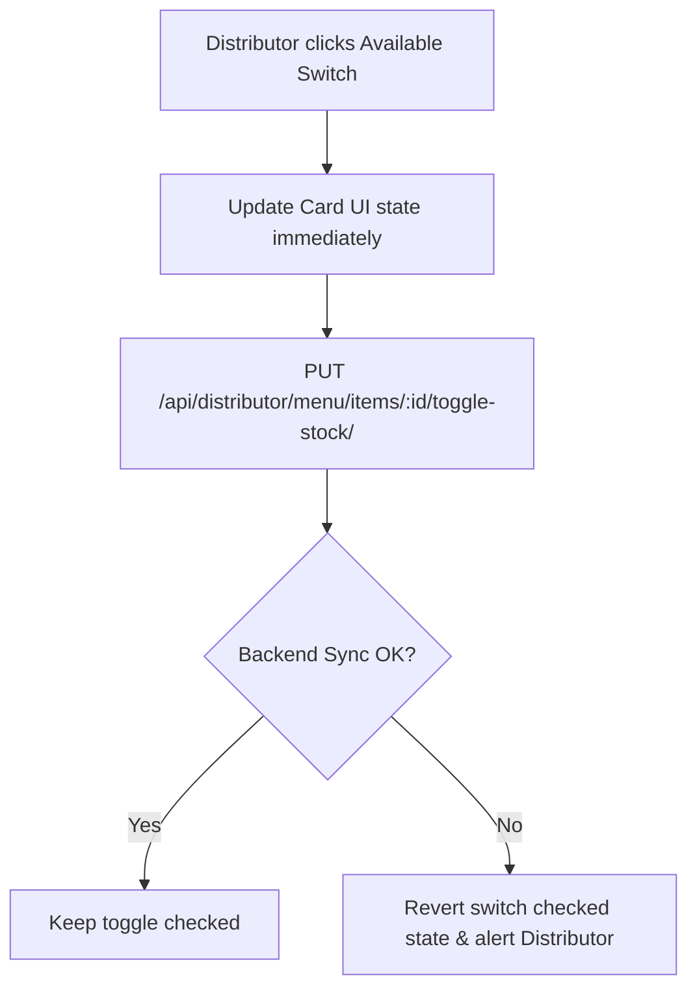

# Document 11: Hotel Ordering Platform - Distributor Menu Management UI & Functionality

This document details the user interface, food item CRUD modals, availability controls, pre-order configuration fields, category managers, state stores, and backend endpoints for the Distributor's Menu Management view.

---

## 1. Page Layout & Wireframe
The Menu Management dashboard provides category filters, a grid of food items showing their stock status and pricing, and a form dialog to create/edit products.

```
+-------------------------------------------------------------------------+
| [Header - Reused from Doc 09]                                           |
+-------------------------------------------------------------------------+
|                                                                         |
|  Menu Items & Categories                                                |
|  [ + Create Category ]        [ + Add New Food Item ]                    | -> Categories & Add Items
|  Categories: [ All ]  [ Starters ]  [ Main Course ]  [ Custom Orders ]  |
|                                                                         |
|  +-------------------------------------------------------------------+  |
|  | +-----------------------+   +-----------------------------------+ |  |
|  | | [Item Image]          |   | [Item Image]                      | |  |
|  | | Spicy Paneer Tikka    |   | Classic Club Sandwich             | |  |
|  | | Price: $12.50         |   | Price: $9.00                      | |  |
|  | | [o] Available Toggle  |   | [o] Out of Stock Toggle           | |  | -> Menu Grid
|  | | Pre-Order: Yes (1 hr) |   | Pre-Order: No (Instant)           | |  |
|  | | [ Edit ]  [ Delete ]  |   | [ Edit ]  [ Delete ]              | |  |
|  | +-----------------------+   +-----------------------------------+ |  |
|  +-------------------------------------------------------------------+  |
|                                                                         |
+-------------------------------------------------------------------------+
| [Footer - Reused from Doc 01]                                           |
+-------------------------------------------------------------------------+
```

---

## 2. Interactive Component Specifications

### A. Category Manager Bar
- **Interaction**:
  - Horizontal list of categories configured for the menu.
  - `"Create Category"` button: Triggers a simple modal input to append a new category identifier to state.
  - Hovering on a category tab shows a delete icon (`X`) to remove empty/idle groups.

### B. Food Item Modal Editor (`<FoodItemModal />`)
- **Fields**:
  - `Item Name`: Text string.
  - `Price`: Numeric input with currency symbol lock, verified to be > 0.
  - `Category`: Dropdown list populated from the Category Manager.
  - `Description`: Character-limited text area (up to 200 characters).
  - `Image File Input`: Drag-and-drop input for food product picture.
  - `Pre-Order Configuration Toggle`:
    - Switches between `"Instant"` (item prepared within standard ticket duration, e.g. 15-20 min) and `"On-Order / Custom"` (dishes requiring advanced prep).
    - If `"On-Order"` is active, renders an input field: `"Preparation Lead Time (Hours)"`. This input feeds into the client-side cart scheduling slots calculation.
- **Stock Availability Switch**:
  - Quick toggle switch on the dashboard item cards.
  - Instantly toggles the product's boolean flag `is_available` in the database, updating customer views instantly to prevent orders of out-of-stock items.

---

## 3. Stock Status Synchronization Flow



---

## 4. Frontend State & Backend API Schema

### Zustand Store: `useMenuStore`
Stores category lists and executes CRUD API integrations:
```typescript
interface FoodItem {
  id: number;
  name: string;
  price: number;
  description: string;
  category: string;
  image: string | null;
  is_available: boolean;
  is_custom_order: boolean;
  preparation_time_hours: number;
}

interface MenuStore {
  categories: string[];
  items: FoodItem[];
  isLoading: boolean;
  fetchMenu: () => Promise<void>;
  saveItem: (item: Partial<FoodItem>) => Promise<void>;
  deleteItem: (id: number) => Promise<void>;
}
```

### Backend API Integration
- **Endpoint 1: Item Listing**
  - Path: `/api/distributor/menu/`
  - Method: `GET`
  - Response:
    ```json
    {
      "categories": ["Starters", "Main Course", "Drinks", "Custom Orders"],
      "items": [
        {
          "id": 101,
          "name": "Spicy Paneer Tikka",
          "price": 12.50,
          "description": "Grilled cottage cheese cubes.",
          "category": "Starters",
          "image": "https://cdn.platform.com/images/items/paneer.jpg",
          "is_available": true,
          "is_custom_order": true,
          "preparation_time_hours": 1.0
        }
      ]
    }
    ```

- **Endpoint 2: Create/Update Item**
  - Path: `/api/distributor/menu/items/` (POST for create, PUT to `/items/:id/` for update)
  - Method: `POST` / `PUT`
  - Response: `{ "success": true, "item_id": 101 }`

---

## 5. Next Steps
We will proceed to **Document 12: Distributor Delivery Settings UI & Functionality**. This handles home delivery toggles, radius controls, pricing parameters, and delivery windows.
