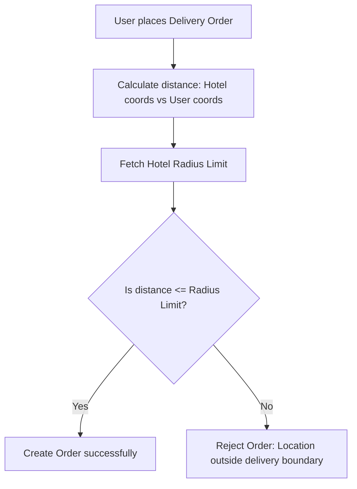

# Document 12: Hotel Ordering Platform - Distributor Delivery Settings UI & Functionality

This document details the user interface, home delivery toggles, radius controls, delivery slot block configurations, minimum order thresholds, fee matrices, and backend endpoints for the Distributor's Delivery Settings view.

---

## 1. Page Layout & Wireframe
The Delivery Settings page allows distributors to configure how they handle logistics. Toggling home delivery exposes sub-configurations including fee pricing, range boundaries, and available active slots.

```
+-------------------------------------------------------------------------+
| [Header - Reused from Doc 09]                                           |
+-------------------------------------------------------------------------+
|                                                                         |
|  Logistics & Delivery Configuration                                     |
|                                                                         |
|  +--------------------+   +------------------------------------------+  |
|  | [Sidebar Portal]   |   | Home Delivery Mode                       |  |
|  | - Dashboard        |   | [o] Enable Home Delivery for customer   |  | -> Delivery Toggle
|  | - Profile          |   +------------------------------------------+  |
|  | - Menu Manager     |   | Delivery Pricing & Boundaries            |  |
|  | - Delivery (Act)   |   | Min Order Amount: [ $15.00            ]  |  | -> Fee Form
|  | - Orders Queue     |   | Flat Delivery Fee: [ $3.50             ]  |  |
|  | - Reports          |   | Radius Limit (km): [ 10                ]  |  | -> Range
|  | - Staff Accounts   |   +------------------------------------------+  |
|  |                    |   | Delivery Slots Schedule                  |  |
|  | [ Log Out ]        |   | [x] Morning (09:00 - 12:00)              |  | -> Time Blocks
|  +--------------------+   | [x] Afternoon (12:00 - 17:00)            |  |
|                           | [ ] Evening (17:00 - 22:00)              |  |
|                           |                                          |  |
|                           | [ Save Logistics Configuration ]         |  | -> Primary Action
|                           +------------------------------------------+  |
|                                                                         |
+-------------------------------------------------------------------------+
| [Footer - Reused from Doc 01]                                           |
+-------------------------------------------------------------------------+
```

---

## 2. Interactive Component Specifications

### A. Home Delivery Enable Toggle
- **Interaction**:
  - Visual toggle switch representing the hotel's `has_delivery` state.
  - **Collapsible Section Panel**:
    - If toggled `OFF`, all input fields (pricing, boundaries, slots) below fade to a 40% opacity level and become non-editable.
    - If toggled `ON`, inputs expand dynamically with a slide-down animation.

### B. Pricing & Boundary Settings
- **Minimum Order Amount**:
  - Value below which checkout displays a block warning to customers (e.g. `"Minimum order amount from this hotel is $15.00"`).
- **Flat Delivery Fee**:
  - Appended dynamically to the customer checkout summary when Home Delivery is selected.
- **Radius Limit Input**:
  - Numeric input or horizontal slider control representing delivery limit (in kilometers).
  - Used on the backend order creation check to cross-reference the customer's delivery coordinates distance against the hotel's coordinates.

### C. Delivery Slots Configuration Matrix
- **Time Block Selectors**:
  - Split into checkboxes corresponding to operational delivery periods:
    - `Morning`: 09:00 - 12:00
    - `Afternoon`: 12:00 - 17:00
    - `Evening`: 17:00 - 22:00
  - Unchecking a slot removes it from the customer order scheduling grid instantly for that distributor.

---

## 3. Delivery Range Check Logic



---

## 4. Frontend State & Backend API Schema

### Zustand Store: `useDeliverySettingsStore`
Holds logistics configurations:
```typescript
interface DeliveryConfig {
  has_delivery: boolean;
  min_order_amount: number;
  flat_delivery_fee: number;
  delivery_radius_km: number;
  active_slots: {
    morning: boolean;
    afternoon: boolean;
    evening: boolean;
  };
}

interface DeliverySettingsStore {
  config: DeliveryConfig | null;
  isLoading: boolean;
  fetchSettings: () => Promise<void>;
  saveSettings: (settings: DeliveryConfig) => Promise<void>;
}
```

### Backend API Integration
- **Endpoint: Fetch Logistics Settings**
  - Path: `/api/distributor/delivery-settings/`
  - Method: `GET`
  - Headers: `Authorization: Bearer <token>`
  - Response:
    ```json
    {
      "has_delivery": true,
      "min_order_amount": 15.00,
      "flat_delivery_fee": 3.50,
      "delivery_radius_km": 10.0,
      "active_slots": {
        "morning": true,
        "afternoon": true,
        "evening": false
      }
    }
    ```

- **Endpoint: Update Settings**
  - Path: `/api/distributor/delivery-settings/update/`
  - Method: `PUT`
  - Request Parameters: JSON matching response above.
  - Response: `{ "success": true, "message": "Delivery parameters updated." }`

---

## 5. Next Steps
We will proceed to **Document 13: Distributor Order Queue UI & Functionality**. This covers the core operational workspace for distributor kitchens, managing status updates, printing receipts, and routing dispatched orders.
