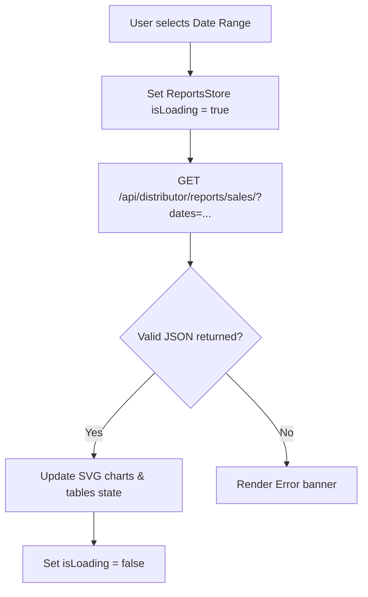

# Document 14: Hotel Ordering Platform - Distributor Sales Reports UI & Functionality

This document details the user interface, date-range filters, charting components, analytical tables, CSV/PDF export options, state management, and backend endpoints for the Distributor's Sales Reports page.

---

## 1. Page Layout & Wireframe
The Sales Reports dashboard displays operational metrics, revenue curves, and meal sales tables.

```
+-------------------------------------------------------------------------+
| [Header - Reused from Doc 09]                                           |
+-------------------------------------------------------------------------+
|                                                                         |
|  Sales Analytics & Reports                                              |
|  Range: [ Last 7 Days ] [ Custom Date Picker ]   [ Export CSV ] [ PDF ] | -> Filters & Exports
|                                                                         |
|  +--------------------+   +------------------------------------------+  |
|  | [Sidebar Portal]   |   | Sales Performance Curve                  |  |
|  | - Dashboard        |   | [SVG Graph Area - Daily Revenue Curves]  |  | -> Chart Widget
|  | - Profile          |   +------------------------------------------+  |
|  | - Menu Manager     |   | Top Performing Menu Items                |  |
|  | - Delivery Setup   |   | Item Name           Qty Sold    Revenue  |  |
|  | - Orders Queue     |   | Spicy Paneer Tikka  120 units   $1,500   |  | -> Performance Table
|  | - Reports (Act)    |   | Classic Sandwich    85 units    $765     |  |
|  | - Staff Accounts   |   +------------------------------------------+  |
|  |                    |   | Key Indicators Summary                   |  |
|  | [ Log Out ]        |   | Total Orders: 205 | Avg Ticket: $22.50   |  | -> Key Indicators
|  +--------------------+   +------------------------------------------+  |
|                                                                         |
+-------------------------------------------------------------------------+
| [Footer - Reused from Doc 01]                                           |
+-------------------------------------------------------------------------+
```

---

## 2. Interactive Component Specifications

### A. Date-Range Filter Selector
- **Interaction**:
  - Dropdown containing presets: `"Today"`, `"Yesterday"`, `"Last 7 Days"`, `"This Month"`, `"Custom Range"`.
  - Custom Range picker shows start-date and end-date calendars.
  - Selecting a range triggers a backend query to load updated analytics data for the charts and tables.

### B. Sales Performance Chart
- **Visuals**:
  - Lightweight SVG line/bar chart displaying daily sales volumes and revenue values.
  - Interactive tooltips display values when hovering over data points.

### C. Top Menu Items Grid
- **Interactive Grid**:
  - A structured data table displaying item performance metrics: Total Units Sold, Gross Revenue, and Customer Ratings.
  - Clicking column headers sorts the data (ascending/descending) by quantity or revenue.

### D. Reports Export Panel
- **Behavior**:
  - `Export CSV`: Hits `/api/distributor/reports/export/?format=csv`, returning a download prompt for file formats compatible with Excel.
  - `Export PDF`: Hits `/api/distributor/reports/export/?format=pdf`, which compiles a professional summary report layout with graphics.

---

## 3. Analytics Loading Flow



---

## 4. Frontend State & Backend API Schema

### Zustand Store: `useDistributorReportsStore`
Holds active datasets:
```typescript
interface TopItem {
  name: string;
  qty_sold: number;
  revenue: number;
  rating: number;
}

interface ReportsStore {
  topItems: TopItem[];
  totalSales: number;
  avgOrderValue: number;
  isLoading: boolean;
  fetchAnalytics: (startDate: string, endDate: string) => Promise<void>;
}
```

### Backend API Integration
- **Endpoint: Sales Data**
  - Path: `/api/distributor/reports/sales/`
  - Method: `GET`
  - Headers: `Authorization: Bearer <token>`
  - Request Parameters: `start_date` (YYYY-MM-DD), `end_date` (YYYY-MM-DD)
  - Response:
    ```json
    {
      "total_sales": 2265.00,
      "avg_order_value": 22.50,
      "total_orders": 205,
      "top_items": [
        {
          "name": "Spicy Paneer Tikka",
          "qty_sold": 120,
          "revenue": 1500.00,
          "rating": 4.8
        }
      ]
    }
    ```

---

## 5. Next Steps
We will proceed to **Document 15: Distributor Staff Management UI & Functionality**. This covers adding staff users, kitchen vs. delivery agent role permissions, and logins credentials CRUD.
