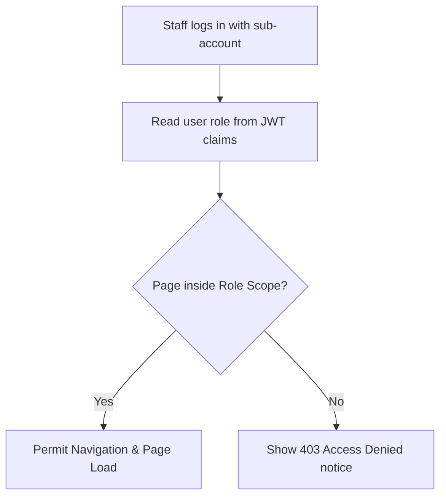

# Document 15: Hotel Ordering Platform - Distributor Staff Management UI & Functionality

This document details the user interface, role access matrix (Manager, Kitchen Staff, Delivery Agent), CRUD sub-account forms, state actions, and backend endpoints for the Distributor's Staff Management view.

---

## 1. Page Layout & Wireframe
The Staff Management interface displays registered sub-accounts and provides a form modal to create, update, or suspend credentials.

```
+-------------------------------------------------------------------------+
| [Header - Reused from Doc 09]                                           |
+-------------------------------------------------------------------------+
|                                                                         |
|  Staff Account Controls                                                 |
|  [ + Add Staff Account ]                                                 | -> Add Account Trigger
|                                                                         |
|  +--------------------+   +------------------------------------------+  |
|  | [Sidebar Portal]   |   | Staff List                               |  |
|  | - Dashboard        |   | Name          Role       Status          |  | -> Staff Table
|  | - Profile          |   | Alice Smith   [Manager]  Active [Edit]   |  |
|  | - Menu Manager     |   | Bob Jones     [Cook]     Active [Edit]   |  |
|  | - Delivery Setup   |   | Charlie Brown [Courier]  Active [Edit]   |  |
|  | - Orders Queue     |   +------------------------------------------+  |
|  | - Reports          |   | Role Permission Summaries                |  |
|  | - Staff (Act)      |   | Managers: Full system control            |  | -> Role Guide
|  |                    |   | Cooks: Kitchen ticket status only        |  |
|  | [ Log Out ]        |   | Couriers: Dispatch directions & COD     |  |
|  +--------------------+   +------------------------------------------+  |
|                                                                         |
+-------------------------------------------------------------------------+
| [Footer - Reused from Doc 01]                                           |
+-------------------------------------------------------------------------+
```

---

## 2. Interactive Component Specifications

### A. Staff Accounts Listing Table
- **Visuals**: Table layout showing: Staff Name, Username, Phone number, Role Badge, Account Status (Active/Suspended).
- **Actions**:
  - `Edit`: Opens the modal editor with pre-filled staff records.
  - `Suspend/Activate Switch`: Instantly toggles account access status to restrict login permissions for that sub-account.

### B. Add/Edit Staff Modal (`<StaffModal />`)
- **Fields**:
  - `Full Name`: Required text.
  - `Username / Email`: Used for login credentials.
  - `Phone Number`: Delivery contact number.
  - `Password`: Plaintext password generation.
  - `Role Selection Dropdown`:
    - **Manager**: Inherits global hotel management scope.
    - **Kitchen Staff (Cook)**: Restricted workspace.
    - **Delivery Agent (Courier)**: Delivery route execution workspace.

### C. Role Access Permissions Matrix
To secure business operations, permissions are enforced on the client side:
- **Manager**: Access to all panels: Profile, Menu editor, Logistics setup, Queue, Reports.
- **Kitchen Staff (Cook)**: Access to the `Dashboard` and `Orders Queue` panels only. Input block prevents cooks from altering menu pricing, logistics options, or viewing sales reports.
- **Delivery Agent (Courier)**: Access to the `Orders Queue` in read-only format for dispatch tasks, allowing them to view delivery locations and mark transactions as completed.

---

## 3. Account Access Flow


---

## 4. Frontend State & Backend API Schema

### Zustand Store: `useStaffStore`
Manages sub-accounts:
```typescript
interface StaffMember {
  id: number;
  name: string;
  email: string;
  role: 'manager' | 'cook' | 'courier';
  is_active: boolean;
}

interface StaffStore {
  staffList: StaffMember[];
  isLoading: boolean;
  fetchStaff: () => Promise<void>;
  createStaff: (data: Omit<StaffMember, 'id' | 'is_active'>) => Promise<void>;
  toggleStaffStatus: (id: number) => Promise<void>;
}
```

### Backend API Integration
- **Endpoint 1: Load Sub-Accounts**
  - Path: `/api/distributor/staff/`
  - Method: `GET`
  - Headers: `Authorization: Bearer <token>`
  - Response: Array of `StaffMember` blocks.

- **Endpoint 2: Create Sub-Account**
  - Path: `/api/distributor/staff/create/`
  - Method: `POST`
  - Request Body: JSON with registration inputs.
  - Response: `{ "success": true, "staff_id": 12 }`

---

## 5. Next Steps
We will proceed to **Document 16: Global Notification Center UI & Functionality**. This covers notification drawers, alerts settings, template forms, and toast banners. Say "Next" to continue.
