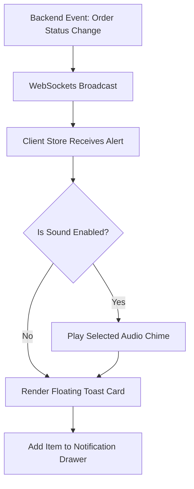

# Document 16: Hotel Ordering Platform - Global Notification Center UI & Functionality

This document details the user interface, sliding drawer components, floating toast controllers, audio alert selectors, state stores, and backend endpoints for the platform's Notification Center.

---

## 1. Page Layout & Wireframe
The Notification Center consists of a sliding panel drawer triggered from the main header and floating toast notification templates.

```
+-------------------------------------------------------------------------+
| [Header - Reused from Doc 01]                       [Badge: 3] [Profile]|
+-------------------------------------------------------------------------+
|                                                      |                  |
|                                                      | Notifications [X]|
|                                                      | [Mark All Read]  | -> Controls
|                                                      |                  |
|                                                      | +--------------+ |
|                                                      | | New Order!   | | -> Alert Card
|                                                      | | Order #1043   | |
|                                                      | | 2 mins ago   | |
|  [Toast Alert: Order #1032 Accepted]                 | +--------------+ |
|  (Dismisses in 5s)                                   | | Ticket #402  | | -> System Card
|                                                      | | Solved       | |
|                                                      | | 1 hour ago   | |
|                                                      | +--------------+ |
+-------------------------------------------------------------------------+
```

---

## 2. Interactive Component Specifications

### A. Sliding Drawer Panel
- **Behavior**:
  - Slide-out transition from the right edge of the screen (`transform: translateX(100%)` to `translateX(0)`).
  - Triggered by clicking the bell icon in the main header.
  - Clicking outside the drawer boundaries (backdrop) closes it.
- **List items**: Displays a list of notifications. Clicking on an item marks it as read and redirects the user to the relevant page (e.g. tracking page or orders queue).

### B. Floating Toast Banners
- **Interaction**:
  - Non-blocking notification toasts appear in the top-right corner.
  - Slide-in from the right, hover-pause duration, and automatic slide-out/fade-out after 5 seconds.
  - Dynamic styling: Green border for success, orange for warnings, blue for system info.

### C. Sound Notification Settings Panel
- **Volume Controller Slider**: Allows users (especially distributors) to adjust chime volumes or toggle silent mode in their dashboard.
- **Alert Ring Selector**: Dropdown selection of custom sound files stored in the frontend assets directory (e.g., `chime_soft.mp3`, `alert_loud.mp3`).

---

## 3. Real-Time Alert Dispatch Flow



---

## 4. Frontend State & Backend API Schema

### Zustand Store: `useNotificationStore`
Tracks alert states and socket connections:
```typescript
interface NotificationItem {
  id: number;
  title: string;
  body: string;
  type: 'order' | 'ticket' | 'system';
  is_read: boolean;
  created_at: string;
}

interface NotificationStore {
  unreadCount: number;
  notifications: NotificationItem[];
  volume: number;
  soundEnabled: boolean;
  addNotification: (item: NotificationItem) => void;
  markAsRead: (id: number) => Promise<void>;
  markAllAsRead: () => Promise<void>;
}
```

### Backend API Integration
- **Endpoint 1: Fetch Alerts**
  - Path: `/api/notifications/`
  - Method: `GET`
  - Headers: `Authorization: Bearer <token>`
  - Response:
    ```json
    [
      {
        "id": 204,
        "title": "New Order Received",
        "body": "Order #1043 has been placed.",
        "type": "order",
        "is_read": false,
        "created_at": "2026-05-29T12:45:00Z"
      }
    ]
    ```

- **Endpoint 2: Mark Notification Read**
  - Path: `/api/notifications/mark-read/`
  - Method: `POST`
  - Request Body: `{ "notification_ids": [204] }`
  - Response: `{ "success": true }`

---

## 5. Next Steps
We will proceed to **Document 17: Help & Support Center UI & Functionality**. This covers user FAQ panels, direct ticket creation fields, and offline resolution grids.
