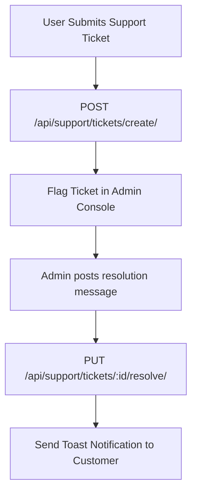

# Document 17: Hotel Ordering Platform - Help & Support Center UI & Functionality

This document details the user interface, search widgets, collapsible accordions, support ticket submission structures, active ticket tables, state management, and backend endpoints for the Help & Support page.

---

## 1. Page Layout & Wireframe
The Help & Support center is divided into an FAQ accordion system, an interactive search input, a ticket form, and a support logs tracker.

```
+-------------------------------------------------------------------------+
| [Header - Reused from Doc 01]                                           |
+-------------------------------------------------------------------------+
|                                                                         |
|  Help & Support Center                                                  |
|  Search support: [ Search FAQs...                                   ]   | -> Search Input
|                                                                         |
|  Frequently Asked Questions:                                            |
|  [+] How does self-pickup work?                                         | -> FAQ Accordion
|  [-] What payment methods do you support?                               |
|      Currently, we only support offline cash payments (Cash on Delivery | -> Expanded Answer
|      or Pay at Hotel). Online payment options will be added soon.       |
|                                                                         |
|  +-----------------------------------+   +----------------------------+ |
|  | Create Support Ticket             |   | Your Support Tickets       | |
|  | Subject:  [ Enter subject       ] |   | Subject    Status  Updated | | -> Ticket History
|  | Order ID: [ Select Order (Opt)  ] |   | Order #1032 Resolved 3h    | |
|  | Message:  [ Enter message       ] |   | Delay Issue Open     1d    | |
|  |                                   |   |                            | |
|  | [ Submit Support Request ]        |   |                            | |
|  +-----------------------------------+   +----------------------------+ |
|                                                                         |
+-------------------------------------------------------------------------+
| [Footer - Reused from Doc 01]                                           |
+-------------------------------------------------------------------------+
```

---

## 2. Interactive Component Specifications

### A. FAQ Search & Collapsible Accordion
- **FAQ Search**: Text input matching FAQ headers. Automatically hides non-matching questions in real time.
- **Accordion Toggle Component**:
  - Visual expansion indicator (`+` / `-` icons) rotating on state change.
  - Smooth animation expanding and collapsing the answer block (`max-height` transitions).

### B. Support Ticket Submission Form (`<SupportForm />`)
- **Fields**:
  - `Subject`: Descriptive subject title.
  - `Order ID Selection Dropdown`: Populated dynamically with the user's recent order IDs (from `useOrderHistoryStore`) to quickly link issues.
  - `Message`: Detail text field explaining the problem.
- **Validation**: Ensures subject and message are populated prior to submitting.

### C. Active Tickets Tracker
- **Visuals**: Structured grid listing user-submitted support inquiries.
- **Ticket Status Badges**:
  - `Open` (Blue): Received and queueing.
  - `Pending Response` (Orange): Under investigation by moderators.
  - `Resolved` (Green): Support team responded and closed the ticket.
- **Message Log View**: Clicking on a ticket card expands a chat timeline showing responses and admin comments.

---

## 3. Help Ticket Resolution Process



---

## 4. Frontend State & Backend API Schema

### Zustand Store: `useSupportStore`
Synchronizes support tickets:
```typescript
interface FAQItem {
  question: string;
  answer: string;
  category: string;
}

interface SupportTicket {
  id: number;
  subject: string;
  order_id: number | null;
  message: string;
  status: 'open' | 'pending' | 'resolved';
  updated_at: string;
  responses: { sender: string; message: string; timestamp: string }[];
}

interface SupportStore {
  faqs: FAQItem[];
  tickets: SupportTicket[];
  isLoading: boolean;
  fetchFAQs: () => Promise<void>;
  fetchTickets: () => Promise<void>;
  createTicket: (subject: string, message: string, orderId?: number) => Promise<void>;
}
```

### Backend API Integration
- **Endpoint 1: Load FAQs**
  - Path: `/api/support/faqs/`
  - Method: `GET`
  - Response: Array of `FAQItem` objects.

- **Endpoint 2: Fetch Tickets**
  - Path: `/api/support/tickets/`
  - Method: `GET`
  - Headers: `Authorization: Bearer <token>`
  - Response: Array of `SupportTicket` items.

- **Endpoint 3: Create Support Request**
  - Path: `/api/support/tickets/create/`
  - Method: `POST`
  - Request Body: JSON with `subject`, `message`, and `order_id` (optional).
  - Response: `{ "success": true, "ticket_id": 405 }`

---

## 5. Next Steps
We will proceed to **Document 18: Admin Super Console UI & Functionality**. This covers global moderation, hotel review verification queues, support ticket handlers, and site status flags. Say "Next" to continue.
