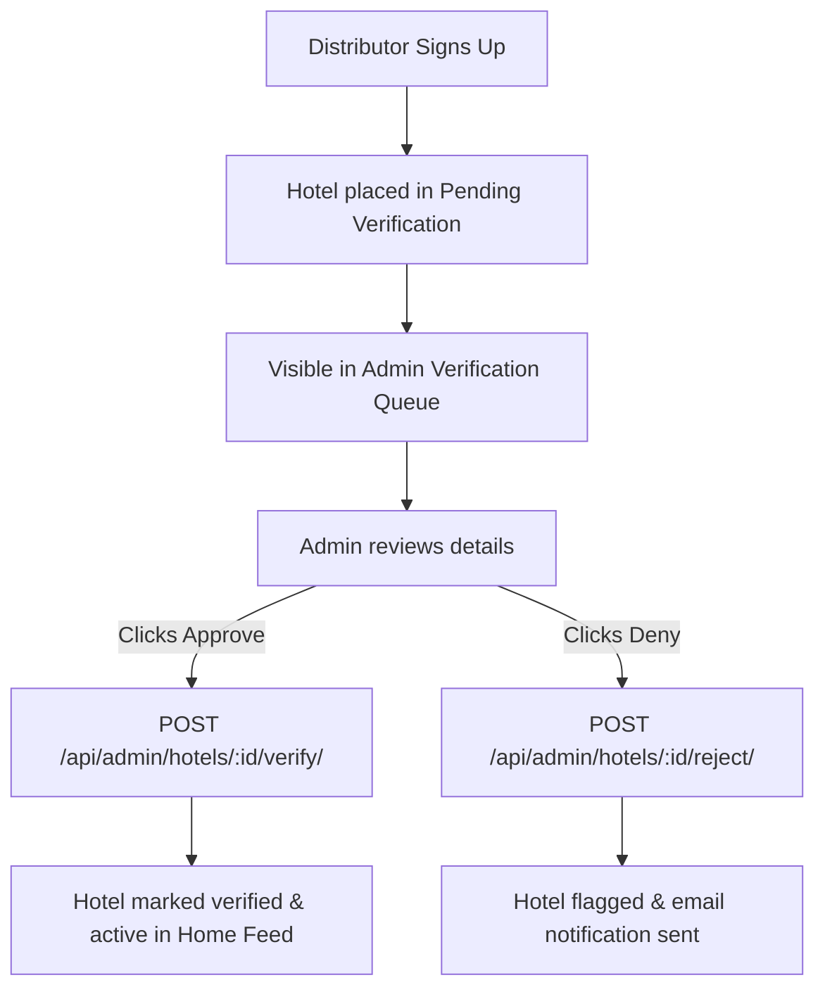

# Document 18: Hotel Ordering Platform - Admin Super Console UI & Functionality

This document details the user interface, hotel verification systems, customer dispute panels, global platform settings, state managers, and backend endpoints for the System Admin Console.

---

## 1. Page Layout & Wireframe
The Admin Super Console is structured with an administrative sidebar. The workspace display switches between verification queues, support ticket channels, and system variables.

```
+-------------------------------------------------------------------------+
| [Header: Admin Console | Superuser Actions                             ]|
+-------------------------------------------------------------------------+
|                                                                         |
|  Global System Administration                                           |
|                                                                         |
|  +--------------------+   +------------------------------------------+  |
|  | [Admin Sidebar]    |   | Hotel Verification Queue                 |  |
|  | - System Overview  |   | Hotel Name        Contact     Coordinates|  | -> Pending List
|  | - Verification Queue|  | Royal Dine        +18833939   40.71, -74 |  |
|  | - Support Tickets  |   | [ Approve (Green) ]   [ Deny / Flag ]    |  |
|  | - Global Settings  |   +------------------------------------------+  |
|  |                    |   | Open Support Tickets Dashboard           |  |
|  | [ Return to Home ] |   | User Email        Subject       Action   |  | -> Ticket Inbox
|  +--------------------+   | user1@email.com   Delay Prep    [Open]   |  |
|                           | [ Chat Box: Reply: [                   ] ] |  | -> Chat Box
|                           | [ Send Response ] [ Close Ticket ]       |  |
|                           +------------------------------------------+  |
|                                                                         |
+-------------------------------------------------------------------------+
| [Footer - Reused from Doc 01]                                           |
+-------------------------------------------------------------------------+
```

---

## 2. Interactive Component Specifications

### A. Hotel Verification Queue
- **Verification Cards**:
  - Displays registered information for unverified distributor signups.
  - Details: Legal Business Name, Owner Contact, Address coordinates verification map anchor.
- **Moderator Actions**:
  - `Approve`: Updates the hotel's `is_verified` status to `true`, making it visible in the customer landing feeds.
  - `Deny`: Prompts for a reason email to be sent to the distributor, removing the hotel record or suspending it.

### B. Support Tickets Dashboard
- **Support Inbox list**: Lists all tickets in `open` or `pending` states.
- **Timeline Chat Box**:
  - Selecting a ticket opens a chronological view of user messages.
  - Text input to reply directly to the customer.
  - `Close Ticket` button: Updates status to `resolved` on the backend, triggers email confirmation, and archive logs.

### C. Global Configuration Panel
- Provides global toggles:
  - `Site Maintenance Toggle`: Puts the frontend into a read-only state with a header banner: `"⚠️ System undergoing maintenance. New orders are temporarily paused."`

---

## 3. Hotel Registration Verification Flow

```thought
Let's design the mermaid diagram.
```


---

## 4. Frontend State & Backend API Schema

### Zustand Store: `useAdminStore`
Controls administrative queue listings:
```typescript
interface PendingHotel {
  id: number;
  name: string;
  contact_number: string;
  address: string;
  latitude: number;
  longitude: number;
}

interface AdminStore {
  pendingHotels: PendingHotel[];
  openTickets: object[];
  isLoading: boolean;
  fetchPendingHotels: () => Promise<void>;
  verifyHotel: (id: number, approve: boolean) => Promise<void>;
  replyToTicket: (id: number, message: string) => Promise<void>;
}
```

### Backend API Integration
- **Endpoint 1: Load Verification Queue**
  - Path: `/api/admin/hotels/pending/`
  - Method: `GET`
  - Headers: `Authorization: Bearer <token>` (Superuser restriction)
  - Response: Array of `PendingHotel` blocks.

- **Endpoint 2: Verify Action**
  - Path: `/api/admin/hotels/:id/verify/`
  - Method: `POST`
  - Request Body: `{ "approved": true, "reason": "" }`
  - Response: `{ "success": true }`

---

## 5. Next Steps
We will proceed to **Document 19: Global UI/UX Design System Specification**. This covers global colors (HSL scales), typography standard, reusable buttons, CSS variables, and layout guidelines. Say "Next" to continue.
