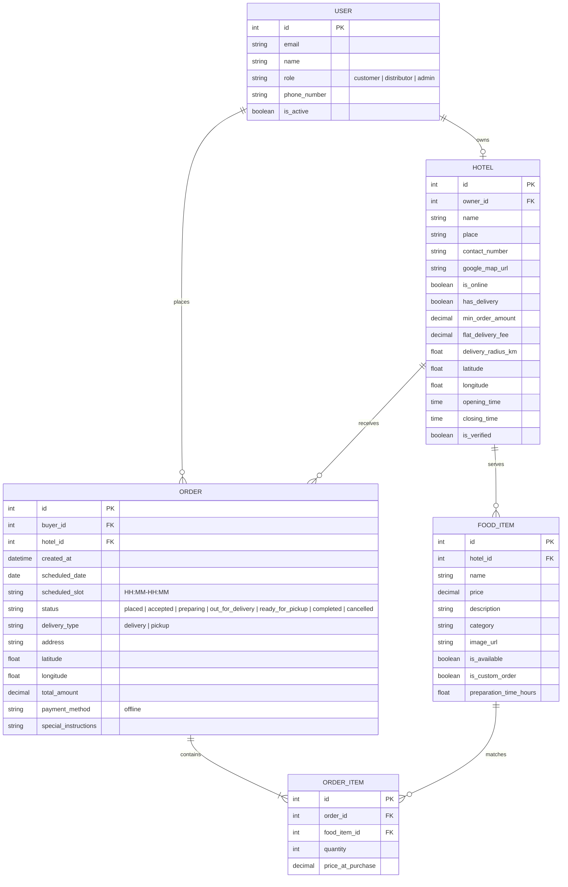

# Document 20: Hotel Ordering Platform - Django API & Backend Architecture Specification

This document details the database models, relations, Django Ninja API structures, dependency management with `uv`, multi-stage Docker configurations, and the CI/CD pipeline.

---

## 1. Django Models & Database Schema

The relational schema maps out the attributes, data types, constraints, and foreign key relations:



---

## 2. API Endpoints Map (Django Ninja)

Using `django-ninja` (Pydantic-based validation and auto-generated Swagger schema), all endpoint definitions are unified under the route namespaces `/api/v1/`:

```python
# config/api.py
from ninja import NinjaAPI
from apps.authentication.router import router as auth_router
from apps.hotels.router import router as hotels_router
from apps.orders.router import router as orders_router

api = NinjaAPI(title="Hotel Ordering Platform API", version="1.0.0")

api.add_router("/auth/", auth_router)
api.add_router("/hotels/", hotels_router)
api.add_router("/orders/", orders_router)
```

---

## 3. Dependency Management with `uv`

The backend uses `uv` for dependency management. Below is the `pyproject.toml` specification:

```toml
# backend/pyproject.toml
[project]
name = "hotel-backend"
version = "1.0.0"
description = "High-performance Django Ninja core for hotel ordering platform"
readme = "README.md"
requires-python = ">=3.11"
dependencies = [
    "django>=5.0.0",
    "django-ninja>=1.1.0",
    "psycopg[binary]>=3.1.0",
    "django-cors-headers>=4.0.0",
    "pyjwt>=2.8.0",
    "gunicorn>=21.2.0",
    "uvicorn[standard]>=0.29.0",
    "celery>=5.3.0",
    "redis>=5.0.0",
]
```

---

## 4. Multi-Stage Docker & Compose Specifications

### Dockerfile (`backend/Dockerfile`)
```dockerfile
# Stage 1: Build virtual environment using uv
FROM python:3.11-slim AS builder
COPY --from=ghcr.io/astral-sh/uv:latest /uv /uvx /bin/

WORKDIR /app
COPY pyproject.toml uv.lock ./
RUN uv venv /opt/venv
ENV PATH="/opt/venv/bin:$PATH"
RUN uv pip install --no-cache -r pyproject.toml

# Stage 2: Production execution environment
FROM python:3.11-slim
WORKDIR /app
COPY --from=builder /opt/venv /opt/venv
ENV PATH="/opt/venv/bin:$PATH"

COPY . .
EXPOSE 8000
CMD ["gunicorn", "config.wsgi:application", "--bind", "0.0.0.0:8000"]
```

### Docker Compose (`docker-compose.yml`)
```yaml
version: '3.8'

services:
  web:
    build: ./backend
    ports:
      - "8000:8000"
    environment:
      - DATABASE_URL=postgres://postgres:secret@db:5432/hotel_db
      - REDIS_URL=redis://redis:6379/0
    depends_on:
      - db
      - redis

  db:
    image: postgres:15-alpine
    environment:
      - POSTGRES_DB=hotel_db
      - POSTGRES_USER=postgres
      - POSTGRES_PASSWORD=secret
    volumes:
      - postgres_data:/var/lib/postgresql/data

  redis:
    image: redis:7-alpine

  celery_worker:
    build: ./backend
    command: celery -A config worker --loglevel=info
    depends_on:
      - redis
      - db

volumes:
  postgres_data:
```

---

## 5. GitHub Actions CI/CD Pipeline

```yaml
# .github/workflows/ci.yml
name: Django Backend CI-CD

on:
  push:
    branches: [ main ]
  pull_request:
    branches: [ main ]

jobs:
  test:
    runs-on: ubuntu-latest
    steps:
      - uses: actions/checkout@v4
      - name: Set up Python
        uses: actions/setup-python@v5
        with:
          python-version: '3.11'
      - name: Install uv
        run: curl -LsSf https://astral.sh/uv/install.sh | sh
      - name: Run Tests
        run: |
          uv run manage.py test

  deploy:
    needs: test
    runs-on: ubuntu-latest
    if: github.ref == 'refs/heads/main'
    steps:
      - name: Build & Push Docker Image
        run: |
          docker build -t ghcr.io/org/hotel-web:latest ./backend
          # Deploy steps to server...
```

---

## 6. Project Specification Complete
This concludes the 21-part architectural design phase. You have a full technical map for both the frontend pages logic and backend services dependencies. Let me know when you would like to move to the implementation phase!
